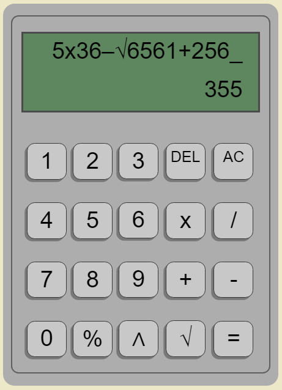
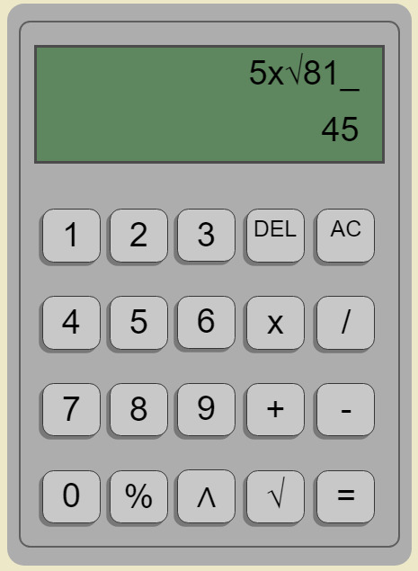
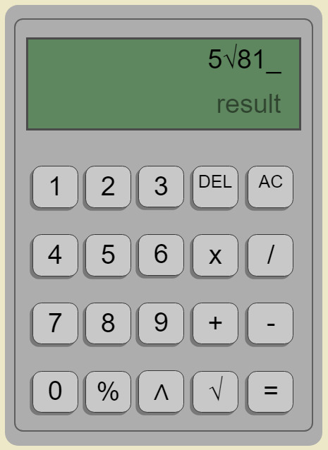
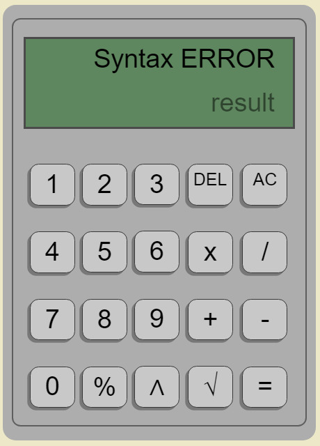

# Calculadora-JS
Practica calculadora - launchX 
## Notas:
La calculadora funciona con numeros enteros, sin embargo puede mostrar resultados con punto decimal.

### Para las raices cuadradas:
Para poder usar las raices cuadradas, se tiene que poner entre algun operador, ya que esta directamente lo transformara a un numero, en caso de que exista un numero antes de alguna raiz cuadrada, mostrara un error de sintaxis.
- Ejemplo de un uso adecuado:

- Ejemplo de un uso incorrecto:

### En caso de errores:
Cuando la calculadora detecte una sintaxis inadecuada, mostrara un "Syntax ERROR".

