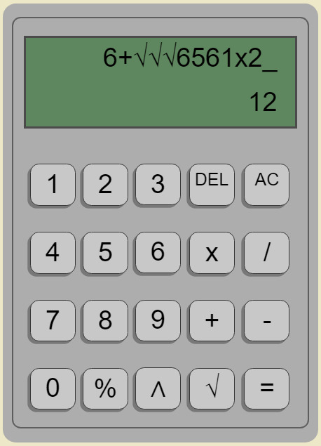

# Calculadora-JS
Practica calculadora - launchX
## Pagina en vivo [Link](https://david-hernandezm.github.io/Calculadora-JS/) !
## Notas:
La calculadora funciona con números enteros, sin embargo, puede mostrar resultados con punto decimal.

### Para las raíces cuadradas:
Para poder usar las raíces cuadradas, se tiene que poner entre algún operador, ya que está directamente lo transformara a un número, en caso de que exista un numero antes de alguna raíz cuadrada, mostrara un error de sintaxis.
#### Ejemplo de un uso adecuado:

#### Ejemplo de un uso incorrecto:

#### Es capaz de anidar raíces, sigue aplicando la regla del buen uso de estas:

### En caso de errores:
Cuando la calculadora detecte una sintaxis inadecuada, mostrara un "Syntax ERROR". Sin embargo, esta no borrara la operación actual, solamente basta ingresar cualquier número u operación, lo agregara a esta y lo mostrara de nuevo, o presionando el botón "DEL", el cual borrara un digito de la operación y volverá a mostrar la operación.

